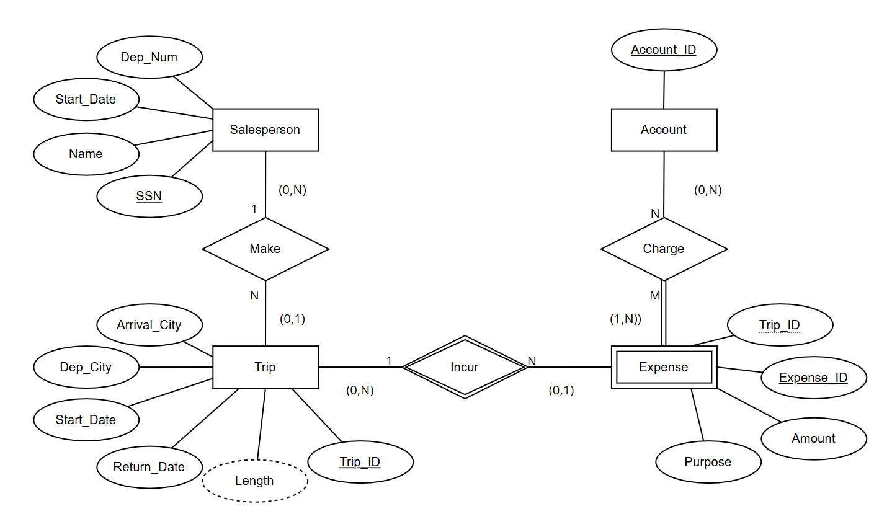

Ilana Berlin  
CSCI 327 Extra Credit 

# ER Diagram

# Constraints
<ul>
<li> A trip is made by one Salesperson
<li> Expenses must be charged to an account 
<li> Expenses can be charged to multiple accounts
<li> Accounts can be charged multiple expenses
<li> Expenses belong to a trip 
<li> A trip can have no expenses 